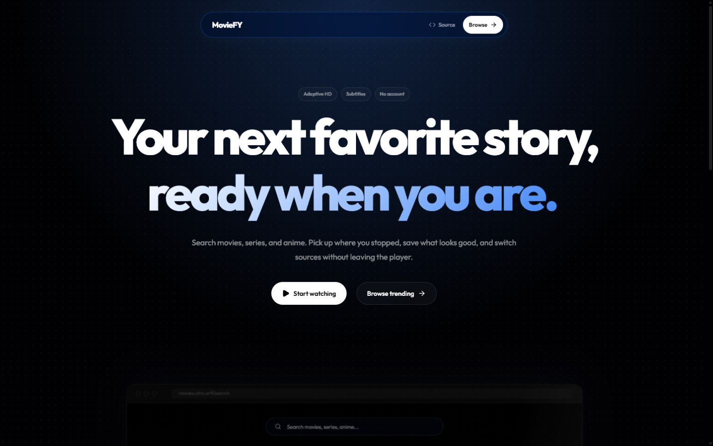
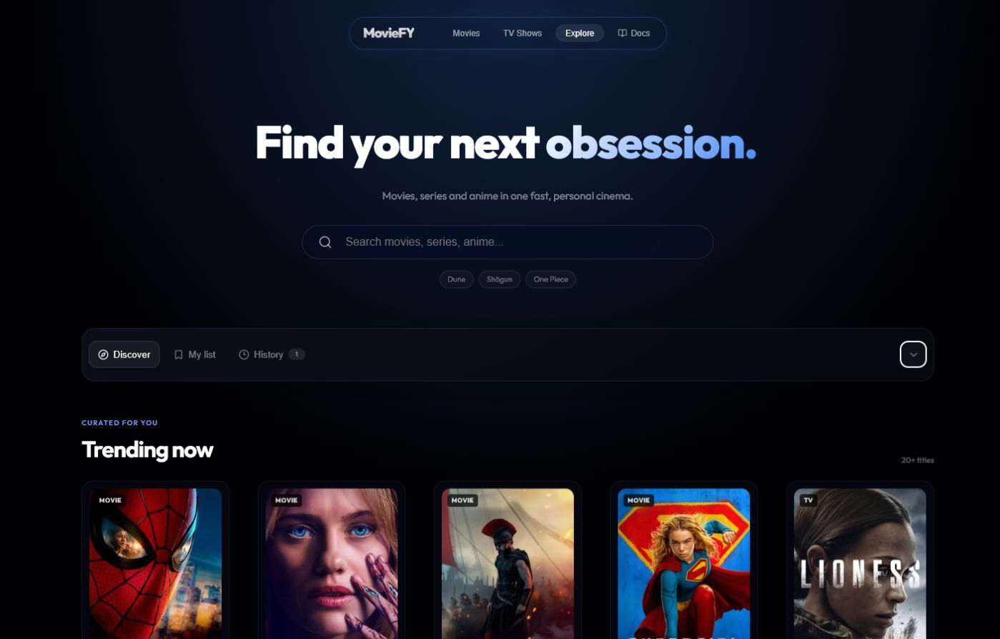
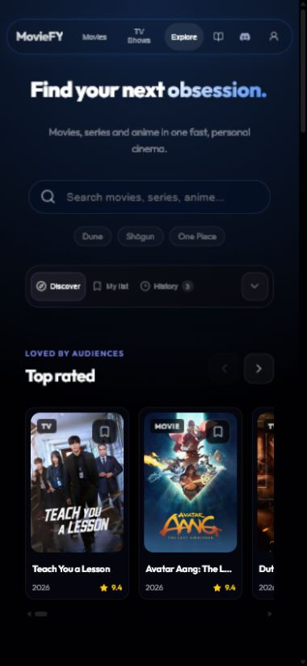

<h1 align="center">MovieFY</h1>

<p align="center">
  A fast, personal place to discover movies, series, and anime.
</p>

<p align="center">
  
  
  
</p>

<p align="center">
  <a href="#screenshots">Screenshots</a> | <a href="#features">Features</a> | <a href="#quick-start">Quick start</a> | <a href="#deployment">Deployment</a>
</p>

MovieFY is a responsive React app for discovering TMDB titles, opening popup-restricted playback sources, and keeping a personal library. It works without an account, with optional Supabase sign-in for cross-device sync.

## Screenshots

<p align="center">
  
</p>

<p align="center">
  
  
</p>

## Features

- Search movies, TV shows, and anime with TMDB metadata
- Browse curated shelves for top-rated titles, new releases, and anime
- Move through every shelf with working previous and next controls
- Filter by media type, full genre list, year, rating, and language
- Sort by trending, popularity, rating, release date, or title
- Switch into a focused results grid when any discovery filter is active
- Open detailed title pages with cast, metadata, and recommendations
- Four popup-restricted playback sources in a custom player shell
- Automatic provider health checks, error detection, and timeout fallback
- Sandboxed embeds that block popup and top-window navigation
- Season and episode selectors for TV shows
- Mandatory next episode when playback finishes, including season boundaries
- Subtitle, adaptive quality, resume, and playback-event support through the selected player
- My List, history, episodes, and progress stored locally by default
- Optional email accounts with secure Supabase synchronization
- Lightweight Firefox rendering fallbacks for systems without hardware acceleration
- Responsive layouts for desktop and phone screens
- Privacy-friendly Umami analytics on `movies.xtra.wtf` only, never on localhost

## Quick start

You need Node.js 18 or newer and a free [TMDB API key](https://www.themoviedb.org/settings/api).

```bash
git clone https://github.com/xtrafr/movies.git
cd movies
npm install
copy .env.example .env
npm run dev
```

Set your key in `.env`:

```env
TMDB_API_KEY=your_tmdb_api_key
```

Account sync is optional. Connect a Supabase project through Vercel or add these local values:

```env
VITE_SUPABASE_URL=your_supabase_project_url
VITE_SUPABASE_PUBLISHABLE_KEY=your_supabase_publishable_key
```

Apply the included secure schema once:

```bash
npm run db:migrate
npm run db:verify
```

For public email registration, configure a custom SMTP provider in Supabase under Authentication, Emails, SMTP Settings. Supabase's built-in sender is intended only for initial testing and has a very small shared email quota. Keep email confirmation enabled.

Vite will print the local address, normally [http://localhost:5173](http://localhost:5173).

## Playback

MovieFY does not host video files. It embeds independent providers that accept TMDB IDs. Availability, subtitles, quality controls, and player events vary by provider and region.

| Source | Role |
| --- | --- |
| ScreenScape | Primary movie and episode player with captions and quality controls |
| APIPlayer | Playback events, progress, subtitles, and auto-next support |
| MoviesAPI | Alternate catalog source |
| EmbedAPI | Multi-source fallback |

Every playback session starts on source 1. MovieFY checks that source through `/api/player-health` and advances only when the automatically selected source returns an error page or cannot be reached. A source selected manually is respected instead of being overridden by the preflight check. TV sources receive mandatory auto-next instructions, while completion events and near-end progress signals immediately move MovieFY to the next episode.

All four sources run inside a browser sandbox without `allow-popups` or top-navigation permissions. Providers that require an unrestricted iframe are intentionally not included.

## Account security

Supabase Auth handles password hashing, verification, password resets, and sessions. MovieFY never stores plaintext passwords or password hashes.

The browser receives only the Supabase publishable key. Database passwords, secret keys, service-role keys, and connection strings remain server-only. Row Level Security restricts every library and preference query to the signed-in user's ID. Anonymous requests cannot read or write synchronized data.

## Tech stack

| Layer | Technology |
| --- | --- |
| UI | React 19 and plain CSS |
| Build | Vite 8 |
| Routing | Browser History API |
| Motion | Framer Motion |
| Icons | Lucide React |
| Metadata | TMDB API |
| Accounts and sync | Supabase Auth and Postgres |
| Analytics | Self-hosted Umami through `/app-data` |

## Project structure

```text
src/
  components/     cards, navigation, discovery controls, docs, player
  hooks/          app state and browser-specific behavior
  lib/            storage, playback, and utility modules
  pages/          landing and discovery routes
  styles/         global, landing, catalog, docs, and player styles
public/
  screenshots/    README previews
```

## Analytics

The tracker loads from `/app-data/script.js` and sends data back through the same path only when the hostname is `movies.xtra.wtf`. Localhost, `127.0.0.1`, preview domains, and custom development hosts do not load the analytics script.

Closing the player or leaving during playback records one `watch-session` event with the elapsed seconds. This gives Umami a final event timestamp for its visit-duration calculation without sending recurring heartbeat events.

Update the website ID in `index.html` if you deploy your own copy. Update the proxy destination in both `vite.config.js` and `vercel.json` if you use another Umami host.

## Deployment

### Vercel

1. Import the repository in Vercel.
2. Add `TMDB_API_KEY` to the project environment variables. Existing deployments using `VITE_TMDB_API_KEY` remain compatible, but the server-only name is recommended.
3. Connect Supabase through the Vercel Marketplace if you want account sync.
4. Apply `supabase/migrations/202608020001_user_library.sql` to the connected database.
5. Configure custom SMTP in Supabase before opening registration to the public.
6. Deploy.

The included `vercel.json` provides SPA routing and the same-origin analytics proxy.

### Static hosting

```bash
npm run build
```

The production files are written to `dist/`. Hosts without server functions and platform rewrites need equivalents for the player health endpoint, SPA fallback, and `/app-data` proxy. A plain static host cannot provide those server-side checks and proxies by itself.

## Commands

```bash
npm run dev
npm run lint
npm run build
npm run preview
npm run db:migrate
npm run db:verify
npm run auth:verify
```

## Legal

MovieFY is not affiliated with TMDB or any embedded playback provider. This product uses the TMDB API but is not endorsed or certified by TMDB. You are responsible for following the laws and provider terms that apply in your region.

## License

MIT
